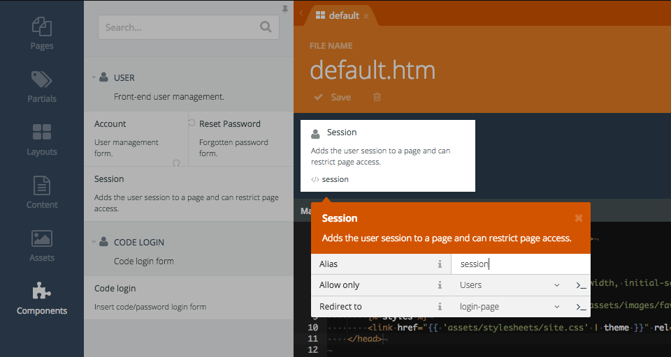
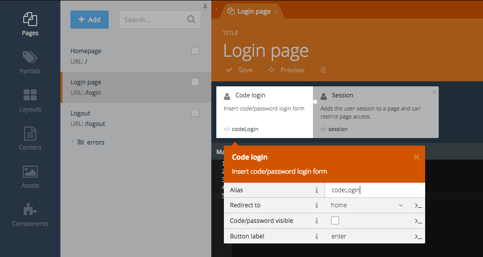
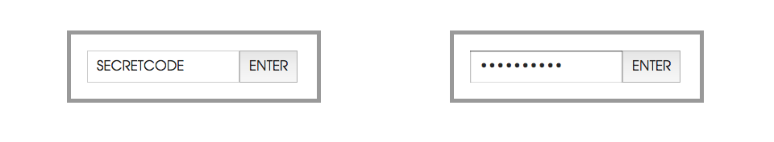
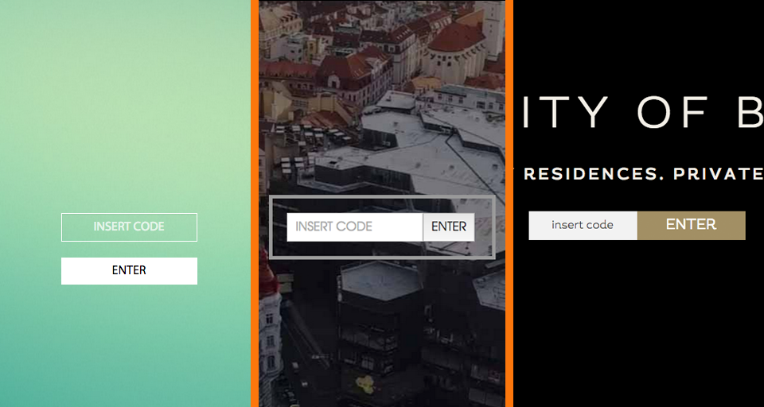

# Code Login for OctoberCMS

[](https://www.codacy.com/app/vojtasvoboda/oc-codelogin-plugin)
[](https://scrutinizer-ci.com/g/vojtasvoboda/oc-codelogin-plugin/?branch=master)
[](https://github.com/vojtasvoboda/oc-codelogin-plugin/blob/master/LICENSE.md)

Login only by code or password. Create secret page or protect whole site just in minute. Tested with the latest stable OctoberCMS build 349.

## Dependencies

RainLab.User plugin for users management.

## How to create secret page

0) Install RainLab.User plugin and then [VojtaSvoboda.CodeLogin](http://octobercms.com/plugin/vojtasvoboda-codelogin) plugin.

1) Insert RainLab.User Session component to layout which you want to protect by code.

<p>
    
</p>

Set Allow property only for Users (means logged users) and then set your login page. All guests will be redirect to login page.

Be sure you have injected JavaScript code and jQuery to your layout:

```
<script src="{{ [
    'assets/javascript/jquery.js',
]|theme }}"></script>



```

Framework extras tag is optional and this tag adds a CSS and JavaScript files that contain the loading indicator plugin and CSS classes for styling the loading indicator. The indicator is displayed on the top of the page when an AJAX request runs.

2) Create login page with Login layout and insert RainLab.User Session component and Code login form. 
Session component set to Allow only guest (login allowed only for guests). 
CodeLogin provide login form and session component will redirect user when already logged.

<p>
    
</p>

Set redirect parameter to your secret page and then set if you want to use input type text or input type password (code will not be visible).

<p>
    
</p>

3) Use default HTML or create own design by extending component template:

- create file `/partials/codeLogin/default.htm`
- copy content from original component template `/components/codelogin/default.htm`
- add classes or HTML you needed

<p>
    
</p>

4) At RainLab.User plugin create as many users as you want. It's recommanded to use unique password for each user, because first user with matched password will be log!

5) [optional] If you want create logout page, just create logout.htm, insert session component allowed for logged user and with redirect to login page. To the template paste this code:

`<a data-request="onLogout" class="btn" data-request-data="redirect: '/login'">Sign out</a>`

6) [optional] For logging all user accesses use [UserAccessLog](http://octobercms.com/plugin/vojtasvoboda-useraccesslog) plugin.

7) [optional] For creating more user accounts use [User import/export](http://octobercms.com/plugin/vojtasvoboda-userimportexport) plugin - just create simple XLS file with usernames and import it (passwords can be generated by [Norton Password Generator](https://identitysafe.norton.com/password-generator/)).

## Events

After successfull login you can use `rainlab.user.login` event to catch logged user instance:

```
Event::listen('rainlab.user.login', function ($user) {
    dump($user);
});
```

## Troubleshooting

### Login button doesn't works.

Be sure you have included jQuery and `` code to your layout (not to page).

### AJAX handler 'codeLogin::onCodesignin' was not found.

If form doesn't work, try to insert Code login component to page, not to partial. Login component should be placed beside to Session component.

## Future plans

**Feel free to send pullrequest!**

- [ ] can change login form input field text
- [ ] code preset with GET parameter e.g. /login?code=abcde
- [ ] unit test for logging method

## License

Code login plugin is open-sourced software licensed under the [MIT license](http://opensource.org/licenses/MIT) same as OctoberCMS platform.

## Contributing

Please send Pull Request to master branch.